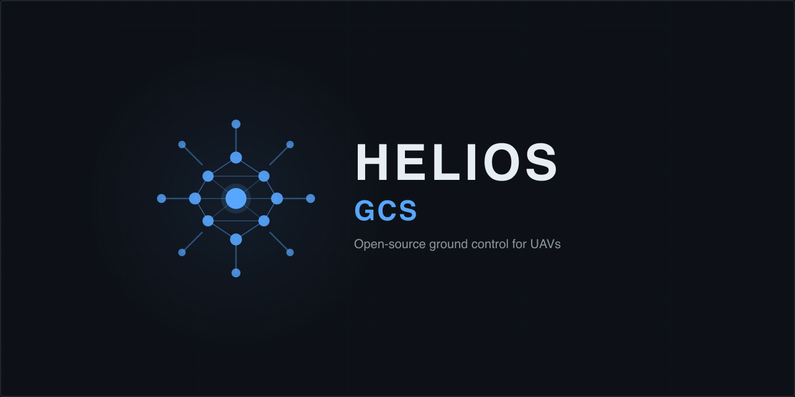

<p align="center">
  
</p>

<p align="center">
  <strong>A modern ground control station built for pilots who want more from their flight data.</strong>
</p>

<p align="center">
  <a href="https://jamesagarside.github.io/helios/">Website</a> &middot;
  <a href="https://jamesagarside.github.io/helios/features.html">Features</a> &middot;
  <a href="https://jamesagarside.github.io/helios/docs.html">Docs</a> &middot;
  <a href="https://github.com/jamesagarside/helios/releases/latest">Download</a>
</p>

<p align="center">
  
  
  
  
</p>

---

## Why Helios?

Ground control software hasn't changed much in a decade. Helios is a fresh take -- designed for the way pilots actually work today.

- **Every flight is data.** Other GCS software treats flight logs as an afterthought. Helios records every telemetry point into a DuckDB database automatically. Analyse flights with SQL, not just basic graphs.
- **Modern interface.** Clean, responsive design that works the way you expect. No cluttered toolbars or hidden menus. Smooth 60fps rendering even at high data rates.
- **Truly cross-platform.** Native performance on macOS, Windows, Linux, iOS, and Android from a single codebase. No emulation layers, no compromises.
- **Open source, no lock-in.** GPL 3.0 licensed. No telemetry, no accounts, no cloud dependency. Your data stays on your machine.
- **Works with your hardware.** ArduPilot, PX4, Betaflight, iNav -- USB, Wi-Fi, or telemetry radio. Just plug in and fly.

## Protocol & Feature Support

Helios supports both MAVLink (ArduPilot, PX4, iNav) and MSP (Betaflight, iNav, Cleanflight). Protocol is auto-detected on connect.

### Flight Controller Compatibility

| Flight Controller | Protocol | Status |
|---|---|---|
| ArduPilot (Plane, Copter, Rover, Sub) | MAVLink v2 | Full support |
| PX4 | MAVLink v2 | Full support |
| iNav (MAVLink mode) | MAVLink v2 | Full support |
| Betaflight | MSP | Full support |
| iNav (MSP mode) | MSP | Full support |
| Cleanflight | MSP | Full support |

### Feature Matrix

| Feature | MAVLink | MSP | Notes |
|---|:---:|:---:|---|
| **Live Telemetry** | | | |
| Attitude (roll, pitch, yaw) | ✅ | ✅ | |
| GPS position & fix | ✅ | ✅ | |
| Altitude (relative to home) | ✅ | ✅ | |
| Altitude (MSL) | ✅ | ✅ | |
| Groundspeed | ✅ | ✅ | |
| Airspeed | ✅ | ❌ | MSP does not expose airspeed sensor data |
| Climb rate | ✅ | ✅ | |
| Battery voltage | ✅ | ✅ | |
| Battery current | ✅ | ✅ | |
| Battery remaining % | ✅ | ✅ | |
| Flight mode | ✅ | ✅ | |
| Armed state | ✅ | ✅ | |
| GPS satellite count | ✅ | ✅ | |
| HDOP (GPS accuracy) | ✅ | ❌ | MSP_RAW_GPS does not include HDOP |
| Vibration (X/Y/Z) | ✅ | ❌ | MSP has no vibration reporting; use Blackbox |
| RSSI | ✅ | ✅ | |
| Status messages / alerts | ✅ | ❌ | No MSP equivalent to STATUSTEXT |
| Status message log overlay | ✅ | ❌ | Scrolling STATUSTEXT feed on Fly View |
| **Fly View Controls** | | | |
| Flight action panel | ✅ | ❌ | ARM/DISARM, mode picker, RTL/LAND/LOITER/AUTO/BRAKE/TAKEOFF |
| Vehicle-type-aware flight modes | ✅ | ❌ | Correct mode names for Copter, Plane, Rover, VTOL |
| Customisable telemetry tiles | ✅ | ✅ | 21 fields; drag-to-reorder, long-press-to-remove |
| **Recording & Analytics** | | | |
| DuckDB flight recording | ✅ | ✅ | MSP uses separate `msp_*` table prefix |
| Altitude chart | ✅ | ✅ | |
| Speed chart | ✅ | ✅ (GS only) | Groundspeed only for MSP; no airspeed |
| Climb rate chart | ✅ | ✅ | |
| Battery chart | ✅ | ✅ | |
| GPS quality chart | ✅ | ✅ (sats only) | Satellite count only; no HDOP for MSP |
| Attitude chart | ✅ | ✅ | |
| Vibration chart | ✅ | ❌ | Not available via MSP |
| SQL query editor | ✅ | ✅ | MAVLink and MSP tables available in same DB |
| Parquet export | ✅ | ✅ | |
| Predictive maintenance | ✅ | ⚠️ Partial | Vibration analysis unavailable without IMU data |
| Flight Forensics | ✅ | ✅ | Cross-flight DuckDB analytics |
| **Setup & Configuration** | | | |
| Connection (UDP / TCP) | ✅ | ✅ | |
| Connection (Serial / USB) | ✅ | ✅ | macOS, Linux, Windows only — not available on iOS/Android |
| Protocol auto-detection | ✅ | ✅ | 5 s probe; first valid frame wins |
| Parameter editor | ✅ | ❌ | MSP has no parameter protocol in Helios |
| Sensor calibration | ✅ | ❌ | ArduPilot/PX4 calibration commands only |
| Stream rate control | ✅ | ❌ | Polling rates are fixed in MSP service |
| **Mission Planning** | | | |
| Waypoint upload / download | ✅ | ❌ | Betaflight has no waypoint mission support |
| DO_ action commands (speed, jump, camera, gimbal, gripper) | ✅ | ❌ | Labelled param editor per command type |
| Multi-select + batch altitude / delete | ✅ | ❌ | Long-press → checkbox mode; Ctrl+A |
| KML / GPX import | ✅ | ❌ | Placemark, LineString, wpt, trkpt |
| Polygon area survey | ✅ | ❌ | Tap polygon vertices → lawnmower grid clipped to shape |
| Geofence | ✅ | ❌ | MAVLink fence protocol only |
| Rally points | ✅ | ❌ | MAVLink only |
| **Simulate (SITL)** | | | |
| One-click SITL launch | ✅ | ❌ | macOS/Linux; native binary auto-download; not iOS/Android/Windows |
| Vehicle + airframe picker | ✅ | ❌ | ArduCopter/Plane/Rover/Sub/Heli + variants |
| Predefined start locations | ✅ | ❌ | CMAC, Duxford, SFO Bay, Sydney + custom lat/lon |
| Wind injection | ✅ | ❌ | SIM_WIND_SPD + SIM_WIND_DIR via MAVLink params |
| Failure injection (GPS, compass, battery) | ✅ | ❌ | Live toggle while SITL running |
| Speed multiplier (1×–8×) | ✅ | ❌ | SIM_SPEEDUP param; test long missions fast |
| SITL log viewer | ✅ | ❌ | Live stdout/stderr stream in Setup tab |
| **Points of Interest** | | | |
| POI markers (pin/star/camera/target/home/flag) | ✅ | ✅ | 6 icons × 6 colours; Plan + Fly View |
| POI details panel (name, notes, coords, altitude) | ✅ | ✅ | Tap to view, long-press to edit |
| Orbit mission generator | ✅ | ❌ | Clockwise circle, configurable radius/laps/speed |
| **No-Fly Zones & Airspace** | | | |
| OpenAIP live airspace fetch | ✅ | ✅ | Free API key required; 7-day local cache |
| GeoJSON airspace file import | ✅ | ✅ | OpenAIP v1/v2 + standard GeoJSON |
| User-drawn NFZ overlays | ✅ | ✅ | Local planning overlays, not sent to FC |
| Waypoint conflict detection | ✅ | ✅ | Highlights wps inside restricted zones |
| **Diagnostic Panels** | | | |
| Servo output viewer (CH1–CH16 PWM bar graphs) | ✅ | ❌ | SERVO_OUTPUT_RAW; traffic-light colour coding |
| RC input viewer (CH1–CH18, RSSI, failsafe) | ✅ | ❌ | RC_CHANNELS; per-channel bars + failsafe badge |
| **Other** | | | |
| Dataflash log download | ✅ | ❌ | Use Betaflight Configurator for Blackbox |
| Video streaming (RTSP) | ✅ | ✅ | Transport-independent |
| Dark / light mode | ✅ | ✅ | |
| Offline map tiles | ✅ | ✅ | |

## Core Features

| | Feature | Description |
|---|---|---|
| **Fly** | Real-time flight instruments | PFD, live map, configurable telemetry tiles, flight action panel |
| **Plan** | Visual mission editor | Drag-and-drop waypoints, area surveys, geofencing, rally points, KML/GPX import |
| **Analyse** | Post-flight analytics | SQL query editor, flight browser, cross-flight comparison, Parquet export |
| **Connect** | Any hardware | UDP, TCP, USB serial. Auto-detects MAVLink or MSP on connect |
| **Video** | Live RTSP streaming | Picture-in-picture with flight data overlay |
| **Simulate** | One-click SITL | Downloads ArduPilot binaries on demand. No Docker. Wind and failure injection |
| **Airspace** | No-fly zone overlays | OpenAIP integration, custom NFZ drawing, waypoint conflict detection |
| **Record** | Every flight, automatically | DuckDB columnar storage. 10-100x faster analytics than SQLite |

See the full feature breakdown at [jamesagarside.github.io/helios/features](https://jamesagarside.github.io/helios/features.html).

## Quick Start

### Download

Pre-built binaries for macOS, Windows, and Linux are available on the [Releases](https://github.com/jamesagarside/helios/releases/latest) page. iOS alpha builds are on TestFlight.

### Build from Source

Requires [Flutter SDK](https://docs.flutter.dev/get-started/install) 3.38+ and platform toolchain (Xcode for macOS/iOS, Visual Studio for Windows, clang/cmake for Linux).

```bash
git clone https://github.com/jamesagarside/helios.git
cd helios
flutter pub get
flutter run -d macos   # or linux, windows, <device_id>
```

### Connect to a Vehicle

1. Open **Setup** (press `4`)
2. Choose transport: **UDP** (default `0.0.0.0:14550`), **TCP**, or **Serial**
3. Click **Connect**
4. Switch to **Fly** (press `1`) to see live telemetry

### No Drone? No Problem

**Telemetry simulator** -- sends synthetic ArduPlane data to localhost:

```bash
dart run scripts/sim_telemetry.dart
```

**Built-in SITL** -- full ArduPilot simulation from the Setup tab. Pick a vehicle, airframe, and start location. Helios downloads the binary on first use. Available on macOS and Linux.

## Recording & Analysis

Every flight is automatically recorded to a DuckDB file. Switch to the **Data** tab to browse past flights, run SQL queries, chart any parameter, or export to Parquet. Think of it as a flight recorder that speaks SQL.

## Project Structure

```
lib/
  core/           Business logic (MAVLink, telemetry, mission, airspace)
  features/       UI views (fly, plan, analyse, setup)
  shared/         Models, providers, theme, widgets
packages/
  dart_mavlink/   MAVLink v2 parser (pure Dart)
```

## Tests

```bash
flutter test           # 558 tests
dart analyze lib/      # zero warnings
```

## Contributing

Contributions are welcome. Please open an issue first to discuss what you'd like to change. See the [docs](https://jamesagarside.github.io/helios/docs.html) for architecture details.

## Licence

[GPL-3.0](LICENSE)

---

<p align="center">
  Part of the <a href="https://github.com/jamesagarside">Argus Platform</a><br/>
  <em>Helios sees from the sky. Argus sees from the ground.</em>
</p>
